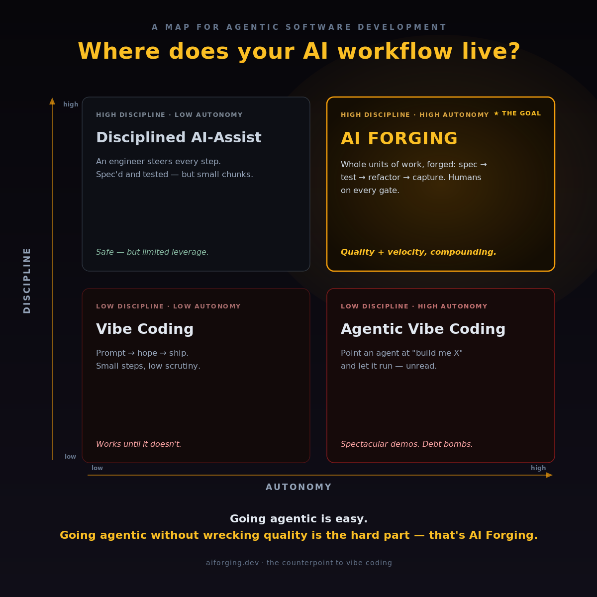
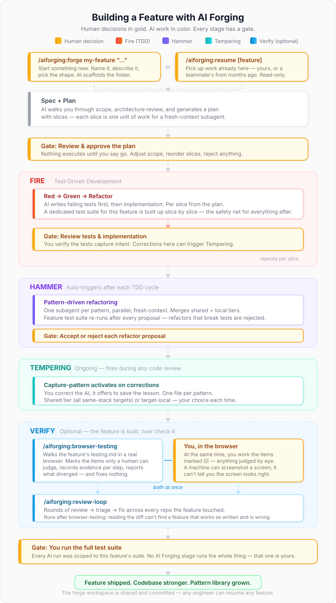

# AI Forging

> A structured framework for **agentic software development** — test-first, pattern-driven refactoring, domain-driven architecture. Shipped as a Claude Code plugin. The counterpoint to vibe coding.

AI Forging is a counterpoint to "vibe coding." The thesis: AI is incredibly powerful at generating code, but without structure, every feature shipped makes the codebase worse. AI Forging provides that structure as three stages of a metallurgical forge: **Fire → Hammer → Tempering.**

**Going agentic is easy. Going agentic without wrecking quality is the hard part.** Autonomy (how big a unit of work you hand the AI) and discipline (how much spec, testing, and review wrap it) are two different axes. Cross them and you get four very different places to build — and AI Forging is the top-right: whole units of work, forged.

<p align="center">
  
</p>

- **Fire** — AI-powered TDD. Tests are written first and capture intent before a single line of implementation exists. Red, Green, Refactor. *Uses the [`superpowers` plugin](https://github.com/obra/superpowers)'s `test-driven-development` skill.*
- **Hammer** — Automated pattern-driven refactoring. The `hammer-refactor` skill dispatches one fresh-context subagent per pattern or anti-pattern file against the session's changed files, in parallel. *Built on top of `superpowers:subagent-driven-development`.*
- **Tempering** — Scalable knowledge capture. The `capture-pattern` skill watches for corrective moments during interactive code review and offers to persist the lesson as a new `.md` file in the pattern library. One correction, one file. Adding the 50th pattern costs no more than the 5th, because every pattern lives in its own file and gets its own subagent on every Hammer pass.

Each iteration through the cycle leaves the codebase stronger than it started.

<p align="center">
  
</p>

## Day-to-day usage

Once your workspace and targets are set up, these are the commands you'll reach for:

**Building a new feature.** From any directory: `/aiforging:forge my-feature-name "brief description of what you want to build"`. It scaffolds a feature folder, pre-fills the spec, and walks you through refining scope and planning before any code is written. (Full form: `/aiforging:new-feature`.)

**Reviewing code and catching a lesson.** You're pair-programming with Claude, spot something less than ideal, and explain the fix. Claude's `capture-pattern` skill activates and offers to persist the lesson as a new pattern or anti-pattern file — one correction, one file, immediately available on every future Hammer pass. It'll ask whether the pattern applies to just this repo or all same-stack targets.

**Hammer passes run automatically.** At the end of each TDD cycle, `hammer-refactor` auto-triggers against the changed files — one fresh-context subagent per applicable pattern, parallel, isolated, no drift. You review each proposal and accept or reject. (You can also invoke it manually against any set of files if you want a targeted pass outside the normal flow.)

**Auditing a codebase you just inherited.** Onboard it with `/aiforging:setup`, and the architecture analyzer produces a scored assessment with prioritized findings. A structured starting point instead of grepping around.

**Planning work that spans repos.** From your forge workspace, `/aiforging:forge tax-inclusive-pricing` creates a single feature folder with one spec covering both backend and frontend targets — slices tagged per-repo, `[gate: contract]` on the API boundary. One plan, no drift between repos.

## Who this is for

Software crafters with **established codebases** who already feel the pain of AI-generated sprawl and are ready to adopt an opinionated workflow. Teams whose backends are built around a Data Mapper ORM (Doctrine, Hibernate, Entity Framework Core, TypeORM, MikroORM) will get the most value out of the box. Teams on Active Record stacks (Eloquent, Rails) can still adopt the framework with caveats documented in the conventions.

AI Forging is **not descriptive** — it is prescriptive, and it will tell you to refactor things. That's the point.

## The three-layer model

AI Forging deliberately separates three locations with different lifecycles:

1. **The plugin itself** — installed once per machine from a marketplace. Holds the conventions library, skills, helper scripts, and the `/aiforging:setup` command. You never clone or edit this.
2. **Your forge workspace** — the directory from which you orchestrate feature work. Bootstrapped by `/aiforging:setup` Phase A. Holds your central `docs/features/<name>/spec.md` + `plan.md` files, a committed `.claude/settings.json` with `enabledPlugins`, and the **shared-tier pattern library** (`.aiforging/patterns/` and `.aiforging/anti-patterns/` with `applies-to` frontmatter for stack filtering). Also installs the workspace-level `capture-pattern` skill for feedback loops that span repos. Designed to accumulate feature history as a git repository over time.
3. **Your target repos** — the codebases being forged. Each is onboarded to a forge workspace via `/aiforging:setup` Phase B. Gets a committed `.aiforging/` (conventions library + empty **target-local pattern directories** + `ANALYSIS.md` snapshot + per-repo `CLAUDE.md` pointer) and, for backend/fullstack repos, committed `.claude/skills/hammer-refactor/` and `.claude/skills/capture-pattern/` so any teammate who clones the repo gets the full toolkit without having to install the aiforging plugin on their machine.

**Workspace as a role, not always a separate directory.** `/aiforging:setup` opens with a scenario interview that adapts to how your codebase is organized:

- **Multiple repos** — the workspace is a separate directory (e.g., `~/forge`) that points at your target repos via `additionalDirectories` in a gitignored `settings.local.json`.
- **Monorepo** — the workspace IS your repo root. Sub-projects (e.g., `frontend/`, `backend/`) are detected and each gets its own `.aiforging/` conventions.
- **Single repo** — the workspace IS the repo. Conventions install at the root.

The split keeps the plugin shareable, each workspace personal, and each target repo self-contained.

**Two-tier pattern library.** Patterns live in two places: a **shared tier** at the workspace level (applies to all targets with matching stacks, has `applies-to` YAML frontmatter) and a **target-local tier** per target repo (applies only to that repo, no frontmatter needed). The `hammer-refactor` skill merges both tiers on every run, filtering by the target's detected stack. The `capture-pattern` skill asks whether each new capture should be shared or target-local. Seeded patterns from the plugin ship in the shared tier; target-local directories start empty.

## Installation

### 1. Install the plugins at the machine level

AI Forging depends on the `superpowers` plugin for TDD and plan-writing skills. You install both plugins once per machine via Claude Code's `/plugin` command:

```
# In your Claude Code CLI:
/plugin marketplace add obra/superpowers
/plugin install superpowers@superpowers-dev

/plugin marketplace add aiforging/aiforging
/plugin install aiforging@aiforging
```

If you've added Anthropic's official plugin marketplace, you can also install these as `superpowers@claude-plugins-official` and `aiforging@claude-plugins-official` respectively — `/aiforging:setup` will ask you which marketplace source to reference when it writes the `enabledPlugins` block.

Installing a plugin at the machine level makes it *available*. Activating it in a specific project is a separate step, handled automatically by `/aiforging:setup` — see the "install vs enable" note at the end of this section.

### 2. Bootstrap a forge workspace

Run `/aiforging:setup` from the directory that will become your workspace. For multiple repos, create a new directory; for monorepos or single repos, `cd` into the repo root:

```
# Multiple repos — create a new workspace directory:
mkdir ~/forge && cd ~/forge && claude
# then: /aiforging:setup

# Monorepo — cd into the repo root:
cd ~/my-monorepo && claude
# then: /aiforging:setup

# Single repo — same as monorepo:
cd ~/my-project && claude
# then: /aiforging:setup
```

This runs **Phase A — init-workspace**. It:

1. Asks how your codebase is organized (multiple repos / monorepo / single repo) and adapts accordingly.
2. Verifies `superpowers` is installed at the machine level.
3. Seeds `CLAUDE.md`, `README.md`, `docs/features/README.md`, and a `.gitignore` into the workspace.
4. Creates a committed `.claude/settings.json` with `enabledPlugins` for `superpowers` and `aiforging`.
5. For multi-repo workspaces only: creates a gitignored `.claude/settings.local.json` for per-user `permissions.additionalDirectories`.
6. Copies the `capture-pattern` skill into the workspace's own `.claude/skills/`.
7. Seeds the **shared-tier pattern library** (`.aiforging/patterns/` and `.aiforging/anti-patterns/`) with the framework's starting patterns.
8. Registers the workspace in `~/.claude/aiforging.json` so commands like `/aiforging:new-feature` work from any directory.
9. For monorepo/single-repo: detects sub-projects and onboards them inline.
10. For multi-repo: offers to onboard the first target project (Phase B).
11. Offers to `git init` (if not already a repo) and stage an initial commit.

### 3. Onboard a target repo

For multi-repo workspaces, either continue into Phase B at the end of Phase A or re-run `/aiforging:setup` at any later time to onboard another target. For monorepo/single-repo workspaces, sub-project onboarding happens inline during Phase A. Either way, **Phase B — onboard-project** performs:

1. Detects the target's stack (Symfony/Doctrine, React/TS/Playwright, etc.) and confirms whether it's backend, frontend, fullstack, or a meta-repo.
2. For multi-repo only: registers the target's absolute path in the workspace's `settings.local.json`.
3. Writes `enabledPlugins` into the *target repo's* own `.claude/settings.json` so teammates who clone the target get `superpowers` + `aiforging` auto-activated without touching their personal config.
4. Copies the conventions library into `<target>/.aiforging/` (architecture, tdd, subagent-orchestration) plus a per-repo `CLAUDE.md` pointer.
5. For backend / fullstack targets, offers to install the `hammer-refactor` + `capture-pattern` skills as a bundle into `<target>/.claude/skills/` so anyone cloning the target repo can run them directly.
6. Creates empty `<target>/.aiforging/patterns/` and `<target>/.aiforging/anti-patterns/` directories for the **target-local tier**. Seeded patterns live in the workspace's shared tier — `hammer-refactor` merges both tiers on every run.
7. Runs the `architecture-analyzer` skill against the target and writes a structured `.aiforging/ANALYSIS.md` report with a score and prioritized findings.
8. Optionally installs the Playwright-oriented frontend testing convention for frontend / fullstack targets.
9. Optionally drafts a feature folder at `<workspace>/docs/features/<feature-name>/` with a `spec.md` and a `plan.md` (in the AI Forging slice format) based on the analyzer's findings.
10. Stages a follow-up git commit in the workspace capturing the onboarding.

Phase B is re-runnable. Each re-run adds another target to the same workspace.

**`/aiforging:setup` will never execute any refactors.** The v0.1.0 boundary is explicit: install + analyze + propose plan. Running the actual Hammer pass is a separate, explicit step via the `hammer-refactor` skill once a plan has been approved. A future `/aiforging:execute-plan` command will orchestrate plan execution with per-step approval gates.

### A note on "install vs enable"

Claude Code keeps these two operations separate, and the distinction matters when teammates clone your workspace or a target repo:

- **Installing** a plugin (`/plugin install …`) downloads its code to `~/.claude/plugins/` on that machine. This is one-time per machine.
- **Enabling** a plugin in a scope writes `{ "enabledPlugins": { "pluginname@source": true } }` into that scope's `.claude/settings.json`. This is what `/aiforging:setup` does automatically for your workspace and for each onboarded target repo.

The enablement block is identifier-based — it *points at* a plugin but doesn't contain the plugin's code. A teammate who clones a target repo inherits its `enabledPlugins` block for free, but they still need to run the machine-level `/plugin install` steps once before Claude Code can actually activate those plugins. Give teammates the same install block from the top of this section and everything else is automatic.

## What's in the plugin

```
aiforging/
├── .claude-plugin/                 # plugin manifest + marketplace definition
├── commands/
│   ├── setup.md                    # /aiforging:setup (Phase A + Phase B)
│   ├── new-feature.md              # /aiforging:new-feature — daily-driver feature scaffolding
│   └── forge.md                    # /aiforging:forge — thin alias for new-feature
├── scripts/                        # PEP 723 single-file Python scripts (run under uv or python3)
│   ├── detect-project.py           #   read-only stack detection (recurses for monorepos)
│   ├── configure-directories.py    #   manages permissions.additionalDirectories
│   ├── configure-plugins.py        #   manages enabledPlugins
│   └── configure-workspace-pointer.py  #   manages ~/.claude/aiforging.json (run-anywhere pointer)
├── skills/
│   ├── architecture-analyzer/      # non-destructive advisory analysis, runs from workspace
│   │   └── SKILL.md
│   ├── hammer-refactor/            # executable Hammer stage, copied into each target repo
│   │   └── SKILL.md
│   └── capture-pattern/            # reactive Tempering feedback loop
│       └── SKILL.md                #   installed in both workspace and each target repo
├── templates/                      # bootstrap templates for forge workspace init (Phase A)
│   ├── workspace-CLAUDE.md
│   ├── workspace-README.md
│   └── docs-features-README.md
└── conventions/                    # library copied into each target repo as .aiforging/
    ├── CLAUDE.md.template          #   per-target CLAUDE.md pointer
    ├── features/                   #   feature-folder + slice-plan convention
    ├── architecture/               #   Domain-Driven Hexagonal, Single-Action Controllers, Repositories, DTOs, Naming
    ├── tdd/                        #   Fire loop (delegates to superpowers), harness capability contract, repository testing
    ├── subagent-orchestration/     #   subagent dispatch conventions (one shot per pattern)
    ├── refactoring/                #   two-tier pattern library + Tempering feedback format
    │   ├── patterns/               #     one file per pattern (applies-to frontmatter for shared tier)
    │   └── anti-patterns/          #     one file per anti-pattern
    └── frontend-testing/           #   optional Playwright layer
```

## Relationship to the `superpowers` plugin

AI Forging deliberately delegates core skills to `superpowers`:

- `superpowers:test-driven-development` — the Red/Green/Refactor loop.
- `superpowers:brainstorming` — spec-before-code dialogue.
- `superpowers:writing-plans` — plan generation.
- `superpowers:executing-plans` — plan execution with checkpoints.
- `superpowers:subagent-driven-development` — fresh-context subagent dispatch, which `hammer-refactor` is built on top of.

AI Forging adds what superpowers intentionally leaves to each team's architecture:

- A prescriptive, domain-centric folder layout.
- Single-action controllers, data-mapper Repositories, Value Objects / DTOs, naming rules.
- The **test-harness capability contract** that makes the Fire stage trustworthy for data-driven code.
- A pattern / anti-pattern library structured for fresh-context subagent refactor passes.
- The `architecture-analyzer` skill for advisory audits.
- The `hammer-refactor` skill as the executable Hammer stage.
- The `capture-pattern` skill as the reactive Tempering feedback loop that grows the library one code review at a time — with a two-tier model (shared across all same-stack targets, or target-local) so cross-pollination is built in.
- An optional Playwright convention layer for frontend integration tests.
- A forge workspace model (separate directory, monorepo root, or single-repo root) with a central `docs/features/<name>/spec.md + plan.md` convention, so features that touch multiple repos (or sub-projects) have one place to plan and track them.

Think of it as a domain-and-architecture opinion layer on top of superpowers. If superpowers is "how", AI Forging is "what you're building and how it should be shaped."

## Upgrading

The plugin code itself updates when you pull a new version from the marketplace. But the artifacts that `/aiforging:setup` *copied* into your workspace and target repos — conventions, skills, seeded patterns — are frozen at the version they were installed at. Two paths to get them current:

### Light upgrade (recommended)

Update the plugin at the machine level, then propagate the changes:

```
# Update the plugin:
/plugin update aiforging@aiforging

# From your forge workspace, propagate updates to all targets:
/aiforging:update-targets
```

`/aiforging:update-targets` diffs every copied artifact (conventions, skills, seeded patterns) against the new plugin version and asks before overwriting. Your user-captured patterns and feature specs are never touched. This is the right choice for minor version bumps and incremental improvements.

### Clean reinstall (for major upgrades or a fresh start)

If you're jumping across major versions, or if your setup feels tangled from experimental changes, a clean reinstall is the safest path:

```
# 1. Remove all plugin artifacts (preserves your feature specs and user patterns):
/aiforging:uninstall

# 2. Update the plugin:
/plugin update aiforging@aiforging

# 3. Re-bootstrap from scratch:
/aiforging:setup
```

The uninstall is designed to preserve your work: `docs/features/` (all your specs and plans), user-captured patterns (anything without `seeded: true` in frontmatter), and customized template files (it asks before removing those). After the reinstall, your workspace will have the latest conventions and skills, and your existing feature history is still there.

**What you'll need to redo after a clean reinstall:** the scenario interview (multi-repo / monorepo / single-repo), target onboarding for each repo or sub-project, and the architecture analyzer run. The setup command walks you through all of this interactively — it's the same flow as the first time, just faster because your repos haven't changed.

## Governance

**AI Forges. Humans decide.** Four human gates, always — checkpoints on completed work, not per-step sign-offs:

1. Review the tests — do they capture your intent? (At feature completion, not one test at a time.)
2. Code review at the PR level.
3. Architecture decisions (which refactors to run, which patterns to add).
4. Deployment authorization.

No autonomous deployment. No silent refactoring. Every proposal goes to a human before a merge happens.

## Status

v0.2.0 — **research preview.** The plugin structure, conventions library, two-phase `/aiforging:setup` command, and the three skills (`architecture-analyzer`, `hammer-refactor`, `capture-pattern`) are all in place and have been dogfooded against real backend targets by both the author and an external tester. The Symfony/PHP/Doctrine stack is the happy path; other stacks work to the extent that the conventions apply (which is substantial, but mileage will vary until we ship dedicated adapters).

**What's in v0.2.0** (see `CHANGELOG.md` for details):

- Service wrapper detection — Dockerized monorepos where the framework code lives in a subdirectory (e.g., `webapp/application/`) are now detected correctly; `.aiforging/` lands at the service boundary, not inside the app subdirectory.
- Playwright convention onboarding no longer skipped when an existing Playwright config is detected — the default flips to Y because an existing setup makes conventions more relevant, not less.
- Global config consent (`~/.claude/aiforging.json`) is now opt-in with a front-loaded explanation of what gets written outside cwd.
- Skill copy messaging explains that the plugin already provides the skills as commands; repo-local copies are for teammate discoverability.

**Also shipped:**

- `/aiforging:new-feature <name> <prompt>` (also aliased as `/aiforging:forge`) — scaffolds `docs/features/<name>/` and hands off to `superpowers:brainstorming`. Works from any directory via the run-anywhere pointer file (`~/.claude/aiforging.json`).
- `/aiforging:update-targets` — propagates plugin-level updates (new skills, new conventions, new shared-tier patterns) into previously onboarded target repos with diff-and-ask semantics.
- `/aiforging:uninstall` — clean removal of all plugin artifacts while preserving your feature specs, plans, and user-captured patterns.
- **Two-tier pattern library** — shared tier at workspace level with `applies-to` YAML frontmatter, target-local tier per repo. `hammer-refactor` merges both; `capture-pattern` asks shared-vs-local at capture time.
- **Workspace-as-role** — `/aiforging:setup` adapts to multi-repo, monorepo, and single-repo scenarios via a scenario interview.
- **Monorepo sub-project detection** — `detect-project.py` recurses into child directories with service wrapper awareness; setup presents detected sub-projects for confirmation.

**Not yet shipped:**

- `/aiforging:execute-plan` — walks through a workspace feature plan with per-step approval gates via `superpowers:executing-plans` and `superpowers:subagent-driven-development`.
- Dedicated stack adapters for Laravel, Spring/Java, .NET/C#, Node/TS.
- A community marketplace of patterns contributed by users.

Contributions welcome once the extension-point contracts stabilize — for now, the best way to contribute is to try it on a real codebase and open issues about what broke.

## Author

[Chris Holland](https://linkedin.com/in/chrisholland) — the guy who [coined](https://www.linkedin.com/feed/update/urn:li:activity:7445936135371083776/?originTrackingId=j81PqnmwyBMk4rNkIUCzbQ%3D%3D) "AI Forging" as a counterpoint to vibe coding.

- Website: [aiforging.dev](https://aiforging.dev)

## License

MIT. See `LICENSE`.

## Acknowledgments

- [Jesse Vincent](https://github.com/obra) and the contributors to [`superpowers`](https://github.com/obra/superpowers) for the TDD, plan-writing, plan-execution, and subagent-dispatch skills that AI Forging builds on.
- [Srdjan Vranac](https://github.com/vranac) for [`claude-session-export-obsidian`](https://github.com/vranac/claude-session-export-obsidian), which served as the structural reference for this plugin.
